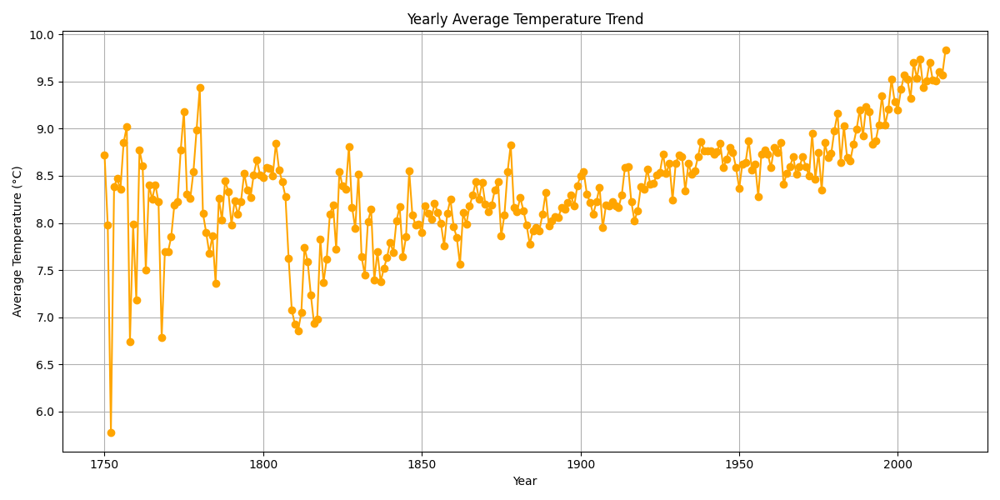
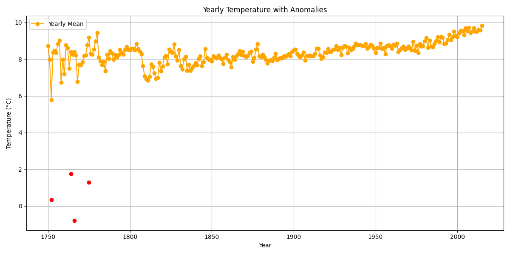
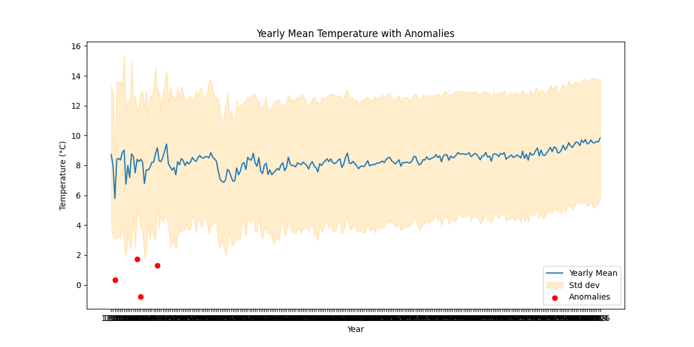
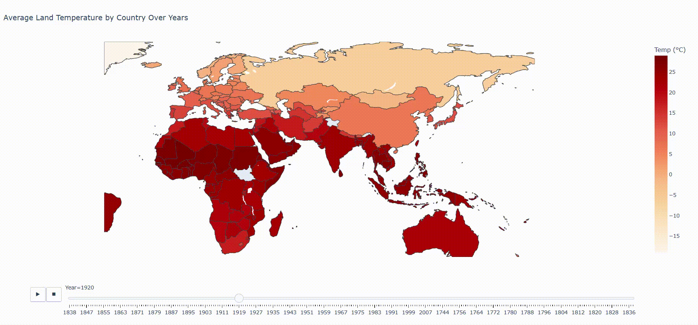

# Climate Change Analyzer with NumPy

## Description
This project analyzes global land temperature data using only NumPy (originally designed to work solely with NumPy).  
It performs statistical analysis, trend estimation, anomaly detection,  
and time-based aggregation to explore climate change patterns. Later, optional visualization features using Matplotlib and Plotly were added 
to generate static plots and interactive country-level maps.

---
### Example Outputs

#### Yearly Temperature Trend


#### Yearly Anomalies


#### Yearly Summary


#### Country Map Preview


#### Interactive Country Map
<a href="https://busracevik.github.io/numpy-climate-analyzer/index.html" target="_blank">Interactive Country Map (Live)</a>

---

## Dataset
This project uses the **Climate Change: Earth Surface Temperature Data** dataset from [Kaggle](https://www.kaggle.com/datasets/berkeleyearth/climate-change-earth-surface-temperature-data).  
It contains historical land temperature records from around the world, collected and published by Berkeley Earth.  
The dataset provides daily and monthly temperature observations dating back to the 1700s, which we use to analyze long‑term trends and anomalies.  

---

## Features
- Data cleaning and preprocessing with NumPy  
- Statistical climate profiling (mean, std, variance, yearly averages)  
- Global warming trend analysis using linear regression  
- Climate anomaly detection using sigma thresholds  
- Yearly temperature aggregation  
- Extreme years identification (hottest and coldest years)  
- CSV export of yearly summaries  
- Visualization of yearly trends and anomalies (saved as PNGs)  

---

## Technologies
- Python 3.x  
- NumPy  
- Matplotlib (for visualization)  
- Plotly

---

## Project Structure

```text
climate_analyzer/
│
├── data/                     # Datasets
│   ├── climate.csv
│   └── climate_by_country.csv
│
├── data/outputs/             # Generated files
│   ├── yearly_summary.csv
│   ├── yearly_summary.png
│   ├── yearly_trend.png
│   └── yearly_anomalies.png
│
├── src/                      # Modular code
│   ├── aggregations.py       # Yearly aggregation functions
│   ├── anomalies.py          # Anomaly detection functions
│   ├── loader.py             # Data loading & cleaning
│   ├── statistics.py         # Basic statistics functions
│   ├── trends.py             # Trend analysis functions
│   └── plotting.py           # Visualization functions
│
├── docs/                      
│   ├── interactive_country_map.html
│   └── interactive_country_map_demo.gif
│
├── main_unmodularized.py     # Original version before modularization
├── main.py                   # Modularized version
└── README.md
 ```  

---

## Development History
1. **Initial Version** (`main_unmodularized.py`)  
   - All code was written in a single file  
   - Basic statistics, yearly aggregation, anomalies, trend analysis, and extreme years detection  
   - Terminal output only

2. **Modular Version** (`main.py`)  
   - Code refactored into reusable functions in `src/`  
   - CSV export of yearly summaries  
   - Visualizations of yearly trends and anomalies saved to `data/`  
   - Easier maintenance and scalability

---

## Use Case
This project demonstrates how large-scale numerical datasets  
can be processed efficiently using only NumPy without external libraries.  
It also shows a workflow from **raw data analysis** to **modular, reusable code**  
with persistent outputs (CSV, PNGs) for further analysis or reporting.
